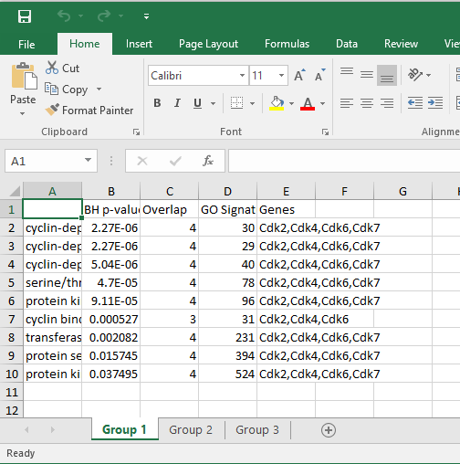

# **simple GO**

*simple GO* is a simple and fast GO enrichment tool with functional clustering of the terms.
For any problem either open an issue in GitHub or contact me at **gio.iacono.work@gmail.com**

To install the package.

```{r}
devtools::install_github("iaconogi/simpleGO")
``` 

To run simpleGO simply pass as input your list of genes, the tool will automatically detect the species (supported mouse or human) and the ID format (official gene symbols or ensembl).

```{r}
results=simpleGO(gene.list=c('Celf4','Eapp','Fzd8','Larp1','Mlxipl','Nr6a1','Phb2',	'Snai2'))
``` 
```{r}
[1] "Preprocessing your gene IDs..."
[1] "Recognized your gene names as Mouse, Gene Symbols"
[1] "Recognized 8/8 of your gene list (100.00 %)"
[1] "Loading mouse data"
[1] "Found 58 terms enriched"
[1] 58  8
Metric: 'jaccard'; comparing: 58 vectors.
[1] "Automatically cutting the tree at 9 percent, with 4 resulting clusters"
[1] "Divided the 58 enriched GO terms into 4 distinct functional groups"
``` 

To facilitate the interpretation of the GO enrichments, simpleGO collapses the enriched terms into functional groups. The output of simpleGOis a list as long as the numeber of functional groups. In this case we have 4 distinct functional groups.
Let's look the first one:

```{r}
head(results[[1]])
``` 
```{r}
                                                                        BH p-value Overlap GO Signature
negative regulation of RNA metabolic process                            1.137030e-06       8         1262
negative regulation of nucleobase-containing compound metabolic process 1.219722e-06       8         1388
negative regulation of gene expression                                  5.841940e-06       8         1775
``` 

With the option `excel.export = file name` you can automatically save the resulting enrichment in an excel file.




<br />
The help of the function `simpleGO` (F1 key in Rstudio) further explains how to change the cutoff for the p-values (setting `p`), how to use a custom background (setting `background`) and how to increase the number of the recognized IDs (setting `use.synonims`).

